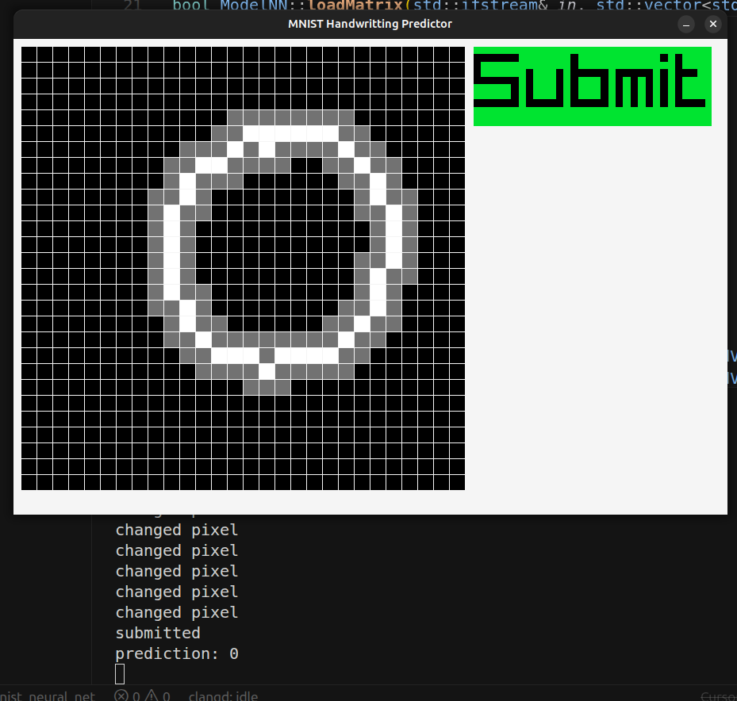
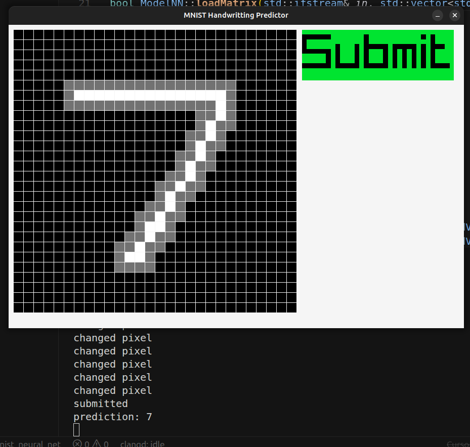
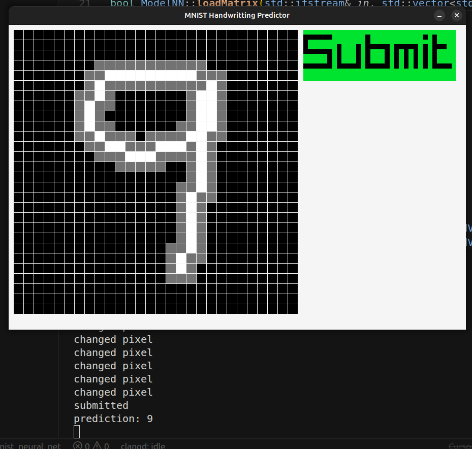

# MNIST handwritting digit recognizer model

This is an implementation of a regression model that aims to recognized handwritten digits. The model was trained 
using the mnist data set.

## Model Architecture

input -> hidden1 -> hidden2 -> output

Activation function: sigmoid function

Loss function: Mean Squared Error

-Input layer has 784 nodes

-Hidden Layer 1 has 100 nodes

-Hidden Layer 2 has 50 nodes

-Output Layer has 10 nodes

## Logistic of model

Using 10,000 test images from the dataset, the model achieved a 93.64% accuracy

## UI and visualization of the model

The UI was done in raylib 5. I created the foundation for the UI and used GPT 5.5 to refine functionalities.

## Important Points to Note:
    1) Initialization of the weights matter:
        - at first, I tried randomly initializing the values from 0 to 1.
        - This made learning impossible because
            - activation function (sigmoid) became saturated aka vanishing gradient
            - gradients explode in values early on
    
    2) Input data must be similar to test data
        - By making the input just a vector of 1s and 0s, the model will not predict values accurately
        - Mnist dataset utilized grayscale as training data and so our input data must match this format

